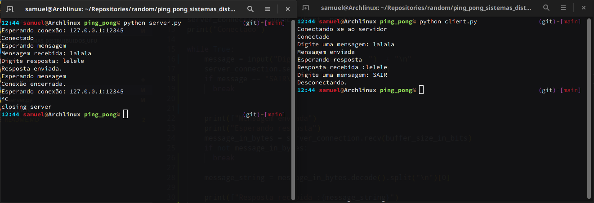

# Exercício: Ping-Pong

Basicamente criar um chat simples, entre um cliente e servidor

## Informações uteis

resolver o o __OSError: [Errno 98] Address already in use__

```zsh
OSError: [Errno 98] Address already in use
```

This is because the previous execution has left the socket in a TIME_WAIT state, and can’t be immediately reused.
There is a __socket__ flag to set, in order to prevent this, __socket.SO_REUSEADDR__:

```python
s = socket.socket(socket.AF_INET, socket.SOCK_STREAM)
s.setsockopt(socket.SOL_SOCKET, socket.SO_REUSEADDR, 1)
s.bind((HOST, PORT))
```

the SO_REUSEADDR flag tells the kernel to reuse a local socket in TIME_WAIT state, without waiting for its natural timeout to
expire.

[python 3 socket reference](https://docs.python.org/3/library/socket.html)


<p align="center">
 <strong>#NaMinhaMaquinaFunciona </strong>
 </p>
